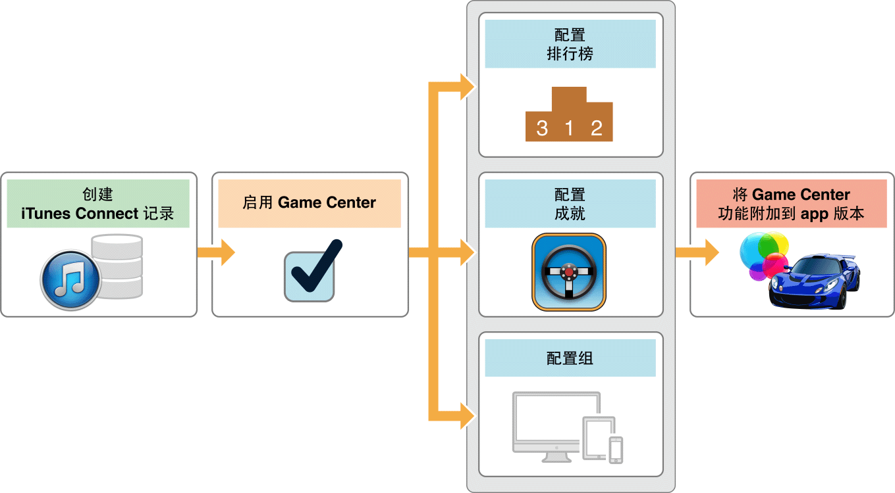
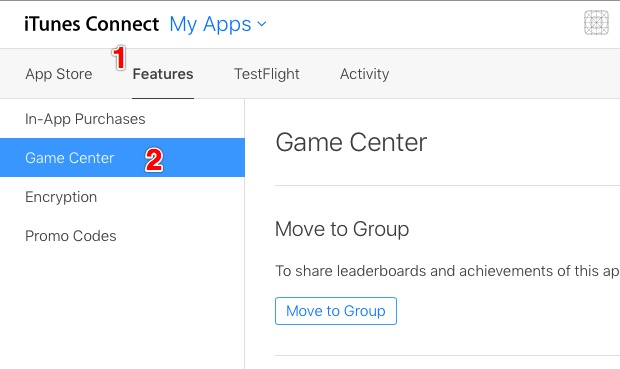
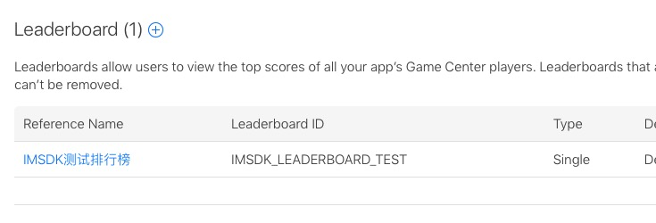
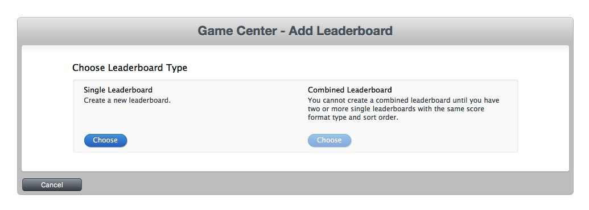
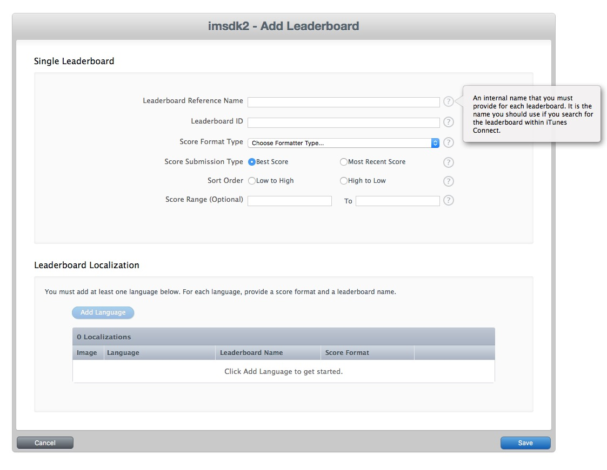

# Game Center开发者中心指引

##简介
Game Center是苹果游戏中心，它可以为iOS平台上的游戏引入社交元素，如好友排行榜，好友挑战。也可以帮助轻量级网游管理成就和排行榜，减少开发者工作量。如果游戏需要支持Game Center，大致需要一下三个步骤：

+ 在开发者中心iTunes Connect中配置
+ Xcode工程配置
+ 代码支持

如图所示

##iTunes Connect配置

1. 创建应用

	在[iTunes Connect](https://itunesconnect.apple.com)中添加新的应用记录，创建bundle id（GameCenter功能区启用不能使用通配符*）。可以查看[官网指引](https://developer.apple.com/library/ios/documentation/LanguagesUtilities/Conceptual/iTunesConnect_Guide/Chapters/CreatingiTunesConnectRecord.html)如何添加一个新的APP。
2. 创建好应用后，就可以配置配置Game Center了。在iTunes Connect中选中目标应用，点击**Features**的Tab，然后在左边导航中找到“Game Center”，如图
3. 新建排行榜（Leaderboards）

	选中Game Center后，在右侧详情页中找到“Leaderboards(0)”，其中0表示当前应用有0个排行榜。
	

点击"+"添加排行版，出现如下界面

这里让我们选中创建单一排行榜还是合并排行榜，这里我们选中单一排行榜(Single Leatherboard)，然后按照要求填入基本信息

+ Leaderboard Reference Name : 排行榜名字，可填入中文；
+ Leaderboard ID ： 排行榜ID，后续代码需要用到；
+ Score Format Type ：分数格式

> 每个输入项有不清楚的地方，可以点击后面"？"查看具体说明

填完基本信息后，我们需要添加至少一个排行榜的本地语言（Leaderboard Localization）

至此，排行榜添加完成

4. 新建成就榜（Achievement）

	创建成就榜和排行榜基本相同，此处不再做详细说明。
	
5. Game Center配置基本完成，然后可以编写接入代码了。

