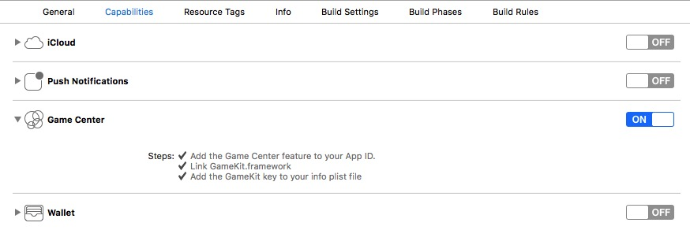
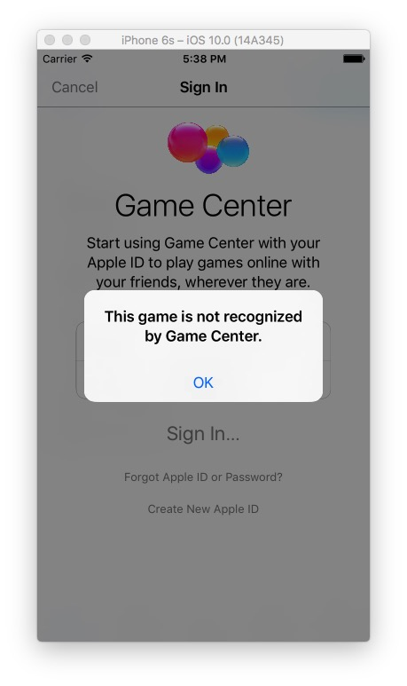

# Game Center工程配置

##工程配置

1. 设置bundleid，找到target，添加对应的bundle id，必须和开发者中心添加了排行榜的应用的bundle id完全一样。

2. 开启Game Center功能支持，找到target，选中 “Capabilities”标签栏，找到Game Center，打开开关。

	
	
##常见问题

1. This game is not recognized by Game Center.

原因：bundle id设置错误或者iTunes Connect设置错误。

