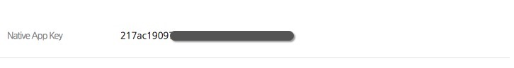
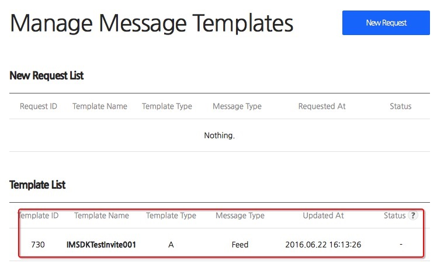

## 6.8.1 Kakao 开发者中心配置

目前，Kakao平台需要业务侧与之Kakao进行相关配置，并未提供开放配置信息，请各个业务自行解决Kakao平台配置

1. 注册及App基础配置

 由于 Kakao 开发者平台只有企业用户才能使用，请联系游戏项目向 Kakao 申请账号，创建 App

2. 获取 native app id

 在管理端 [https://gamecenter.kakao.com/admin/apps](https://gamecenter.kakao.com/admin/apps) 中选择对应的App，在“Detail Info”中找到“Native App Key”字段，即可获取 native app key

 

3. 设置消息模板

 在“Manage Message Templates”菜单中，可以新增消息模板。该模板需要审核，通过后可以看到对应的对应的消息模板

 

 *注意：消息模板需要区分类别，普通的feed和邀请invite不能混用*
