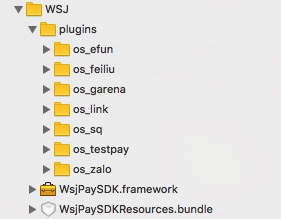

##6.4.2 Midas(iOS) 工程配置

米大师iOS支付分为两部分，**iOS应用内支付（IAP）**与**外发渠道支付**。

###IAP支付
IAP支付。由米大师直接调用iOS Store应用内付费（简称IAP, In app purchase），完成付费流程。

####接入步骤
1. 分别把米大师SDK**MidasIAPSDK.framework**和资源bundle**MidasIAPSDKRescources.bundle**引用到目前target中。
2. Xcode工程的Capability选项中添加KeychainSharing的支付专用 Group，Group ID 为 com.tencent.wsj.keystoregroup;
3. 

####注意事项
1. 环境变量开发联调阶段用test（初始化接口中environment参数），发布前切换成release，且发布前必须保证游戏 后台服务器也接入的是米大师后台的 release 环境，发布前一定要检查。
2. 强烈建议登录态等更后（初次登录、切换登录用户等），立即注册支付接口(register pay)
3. 支付失败回调中，错误码1138(下单),1139/1140/1141(发货)，是由于支付被风控拒 绝而导致下单失败，请游戏直接展示回调返回的 errorMessage 参数的错误 示，告知用户支付失败的原因(errorMessage 内容为“您的账号存在安全风 险，暂时无法支付”)，具体错误码解释如下:
    + 1138:因风控原因的下单失败;
    + 1139 因风控原因的拒绝发货，不封号; 
    + 1140 因风控原因的拒绝发货，并封号; 
    + 1141 因风控原因的继续发货，但封号。
4. 必须用没有越狱的设备测试 IAP 支付（切忌使用模拟器测试支付）

####支付流程详解
1. 支付流程

2.补发货流程。

在 IAP 支付成功后，由于现网环境的复杂性等原因，有一定可能造成发货失败 的，本 SDK 采用 iOS IAP 的机制，按照没有被标记为发货的票据，来进行补发 货。

补发货发生在 App 第一次调用 registerPay 的时候，其内部实现为在 registerPay 时，内部初始化 IAP 的 SKPaymentQueue，由 SKPaymentQueue 内部的实现机制去 检查本地是否有仍没有发货成功的票据，从而推送到 SDK 上，发起补发货流程。

###外发渠道支付
+ 外发渠道支付。米大师通过第三方合作方支付系统，完成支付流程。

MidasIAPSDK.framework为米大师核心包，MidasIAPSDKRescources.bundle为米大师资源包，二者均为必选。

plugins分别为米大师不同支付外发渠道，根据实际项目需求引入不同的支付渠道即可。