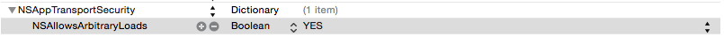
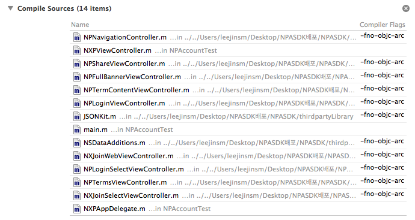
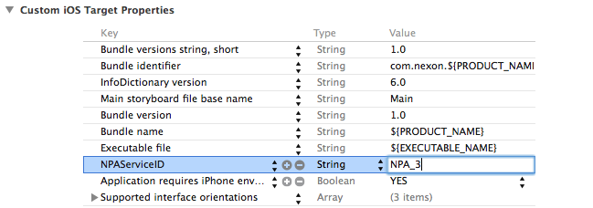

#Toy iOS工程配置

##1.Xcode配置   
+ 在工程中 Project > Build Settings > Linking > Other Linker Flags添加'-ObjC'
+ iOS9配置
  
+ Toy 原生SDK为非arc所以要对应添加非arc标志     
  
+ 项目info.plist添加NPAServiceID一般格式：NPA_xxxx     
  
###2.系统依赖库   
AssetLibrary.framework     
CoreLocation.framework     
CoreMotion.framework     
CoreText.framework     
CoreGraphics.framework      
MediaPlayer.framework     
SystemConfiguration.framework      
AddressBook.framework      
Security.framework     
CoreData.framework      
AdSupport.framework      
GameKit.framework     
UIKit.framework     
Foundation.framework     
libsqlite3.tbd     
libz.tbd     
Accounts.framework     
CoreTelephony.framework     
Social.framework     

