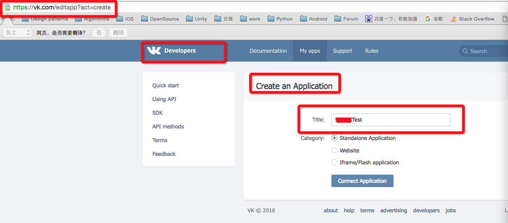
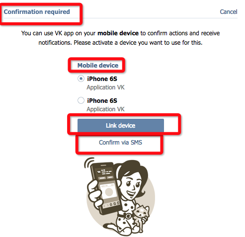
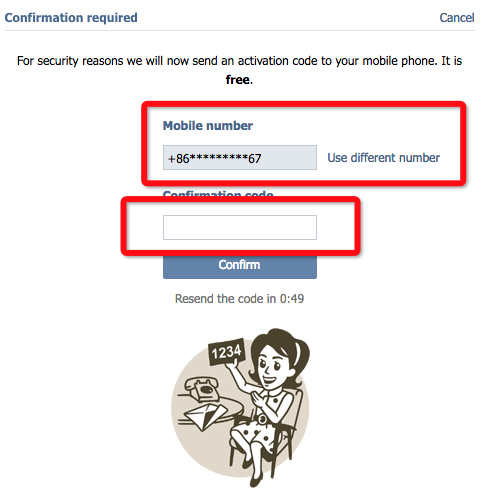
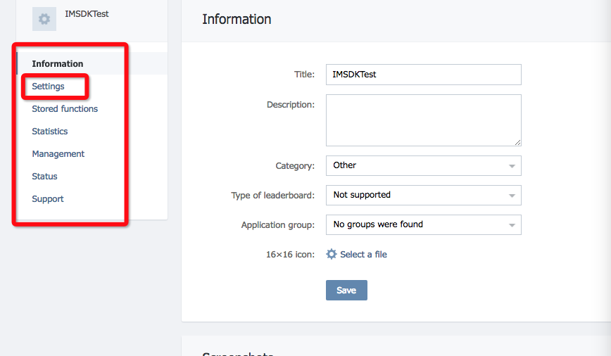
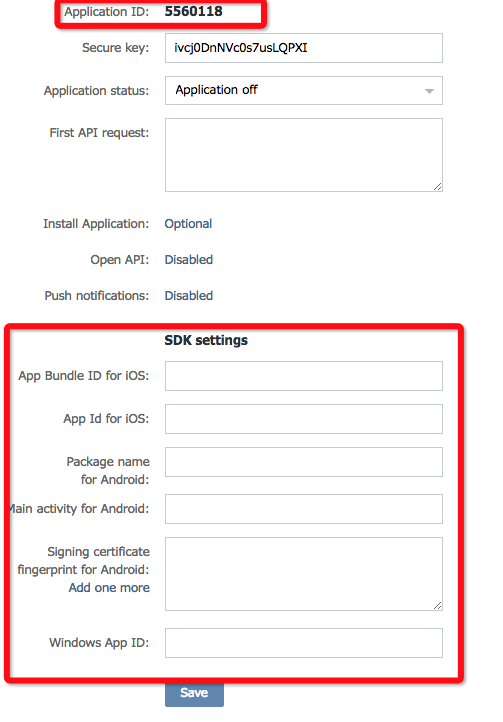
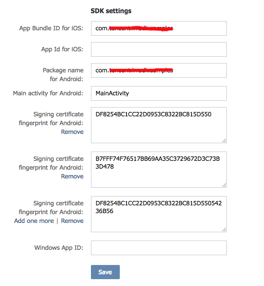
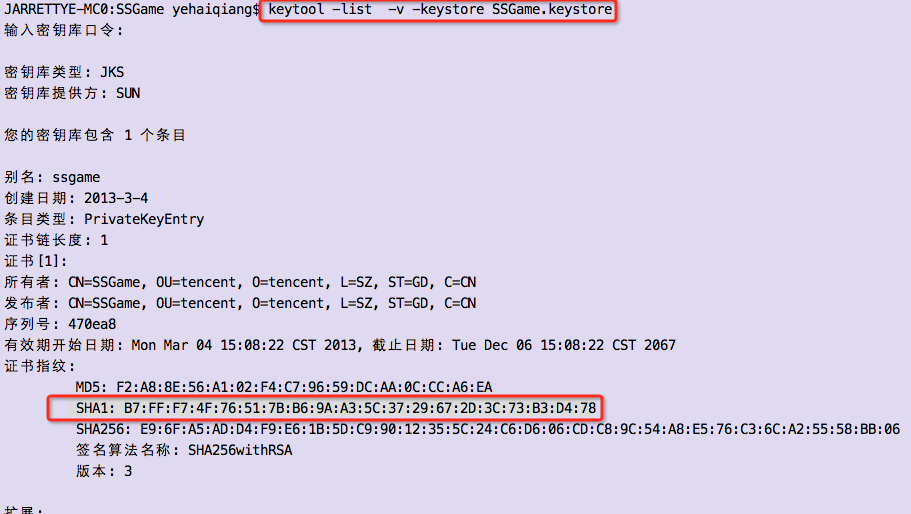

## 6.9.1 VK 开发者中心配置

###1. 注册、配置VK账号信息

  * 在VK官方创建一个app     
    * 创建app   
      
    * 验证    
      
    
    
    * 获取app id    
      * 点击 settings
      
      * settings下就可以看到app id
      
    * Settings    
    
 
    * 关于Android fingerprint的计算    
      

###2. [配置iMSDK后台](../../Server/README.md)

 请到iMSDK管理段进行后台配置，联系人RTX：hirryli