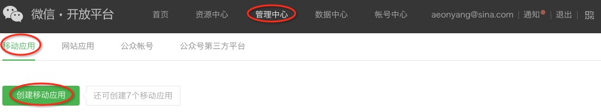
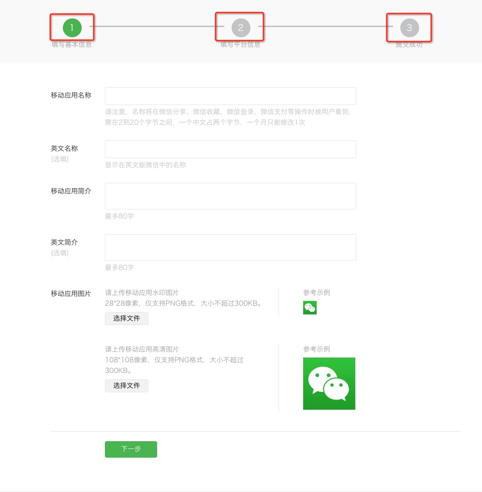
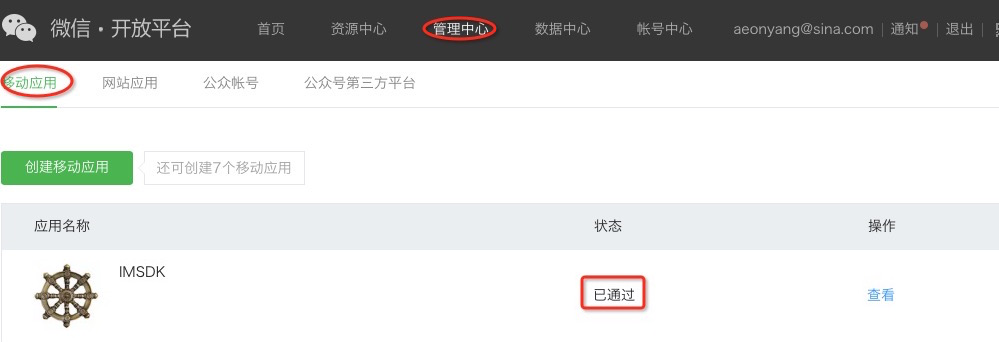
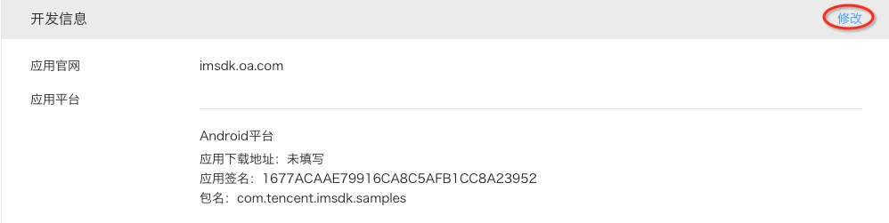

### 6.3.1 WeChat 开放平台配置


1. 注册微信开放平台账号

  进入开放平台网址：[https:\/\/open.weixin.qq.com](https://open.weixin.qq.com)

  点击右上角注册注册按钮，或直接打开网址:[https:\/\/open.weixin.qq.com\/cgi-bin\/readtemplate?t=regist\/regist\_tmpl⟨=zh\_CN](https://open.weixin.qq.com/cgi-bin/readtemplate?t=regist/regist_tmpl&lang=zh_CN)

  按照提示进行资料填写：

  

  并完成开发者资质认证：

  

  > 腾讯内部认证渠道：[http:\/\/mmbiz.oa.com\/verify](http://mmbiz.oa.com/verify)

2. 新建App

  在管理中心，新建App

  

  并按要求填写资料

  

  等待审核通过

  

3. 获取App ID 和 App Secret

  点击应用列表中对应应用右侧“查看”，查看相关信息

  

4. 配置信息

  在“管理中心\/应用详情”页面下方，修改应用配置

  

  并按要求填写相关信息

  

  > 应用签名字段，可以通过运行指令
  > 
  > ```sh
  >  keytool -exportcert -alias androiddebugkey -keystore debug.keystore -list -v
  > ```
  > 
  > 获取，并且需要根据自己编译应用的Keystore信息修改别名androiddebugkey和文件路径debug.keystore
  >  输入密码后，找到
  > 
  > ```sh
  >  MD5: 16:77:AC:AA:E7:99:16:CA:8C:5A:FB:1C:C8:A2:39:52
  > ```
  > 
  > MD5信息，将值中间的":"去掉后，就是我们需要填的值


