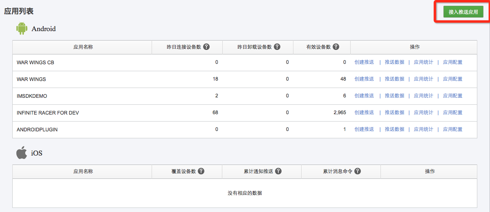
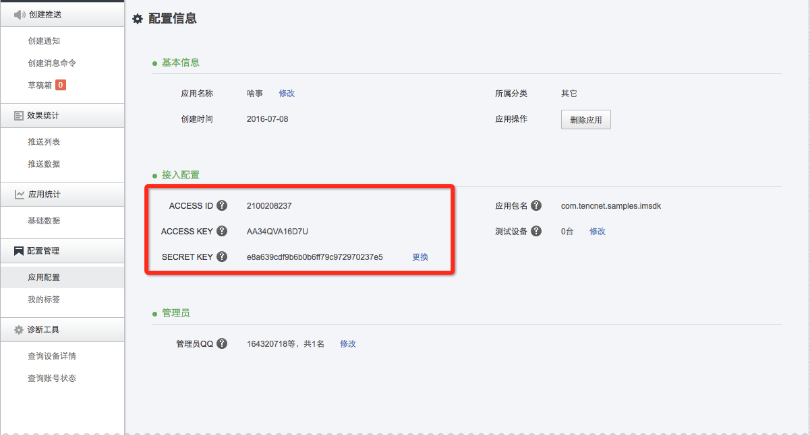

## 6.4.1 信鸽开发者中心配置
#### 1. 到[信鸽官网](http://xg.qq.com)用QQ号进行登录
#### 2. 下图是登录后，应用接入的入口示例图，点击之后按照要求填写资料即可

#### 3. 点击上图的"应用配置"， 如下可以找到应用的配置信息
 
 #### 4. 选择对应平台进行配置
 
  * [Android 配置](android.md)
  * [Unity 配置](Unity.md)
  * [Cpp 配置](cpp.md)
  
  > [信鸽GCM 版本](../xg_gcm.md)是信鸽针对海外业务需求定制的，包含了GCM和信鸽功能。在GCM可以推送的情况下，优先走GCM通道，在GCM通道不通的情况下，还会走信鸽通道推送。