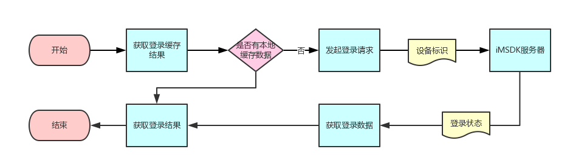
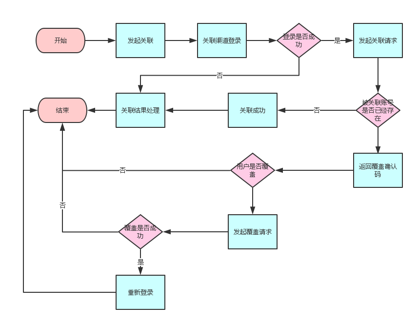
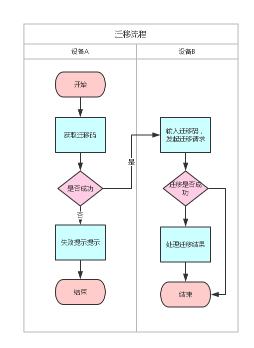

## Auth模块

### 背景简介

​ 以设备（即游客）为中心的账号体系，这样可以不影响游戏的进度，根据设备唯一码，到 iMSDK 后台生成对应的 openid，弱化登录流程。然后，游戏通过提示关联到指定渠道的方式，把所有的渠道（比如 Google Play，Game Center） 都关联到设备上，这样就可以通过第三方渠道进行数据迁移。

​ 这种关联到游客的方式，由于关联之后的功能不同，可以分为 `强关联` 以及 `弱关联` 两种模式：

1. 如果都是关联到设备A，即之前没有关联过其他的设备，那么应该返回成功，两者没有区别

2. 如果已经关联到设备A，当前需要再关联到设备B的情况，那么

 | 类型 | 关系链以及分享功能 | 账号迁移 | 设备对应的openid是否改变 |
 | ---- | :-------: | :--: | :-------------: |
 | 强关联 | 是 | 可以 | 是 |
 | 弱关联 | 是 | 不可以 | 否 |

> 强弱关联是由后台配置的，所以游戏方可以配置 Facebook 为强关联，这样就可以进行 Android 与 IOS 的账号迁移。但是，像 Google Play 跟 Game Centre这种平台独占的，后台默认设为强关联的模式。

### 快速入门

1. [完成特定的渠道配置](http://docs.itop.qq.com/reference/Channel/)，比如需要关联到 Facebook 就选择配置 Facebook

2. 代码实例

 ```csharp
 void Start() {
 IMSDKApi.Auth.Initialize ();
 }

 // 第一步，一般在游戏开始时，进行开始授权动作，相当于游客登录
 public void StartAuth(){
 IMSDKApi.Auth.Auth ((IMAuthResult result)=>{
 //TODO 处理授权的回调
 });
 }

 // 第二步，在合适的时机，提示用户进行关联操作，比如关联Google Play
 public void StartConnect(){
 IMSDKApi.Auth.Connect ("Google", (IMConnectResult result)=>{
 // TODO 根据关联返回的result.ThirdRetCode处理下一步的动作，
 // 返回码为 1: 关联成功
 // 返回码为 2: 需要进行重新关联，即 IMSDKApi.Auth.Reconnect
 // 返回码为 3: 需要进行恢复动作，即 IMSDKApi.Auth.Restore
 });
 }
 ```

### 参考

* 授权类 <font color="blue">IMAuth</font>

 | **函数名** | **函数说明** |
 | ---------------------------------------- | ---------------------------------------- |
 | public void Initialize () | 初始化方法，在调用其他函数之前需要调用该函数 |
 | public void Auth (<br>IMSDKCallback<IMAuthResult> callback<br>) | 设备授权，相当于游客登录 |
 | public IMAuthResult GetAuthResult() | 获取本地缓存的授权信息 |
 | public void Connect (<br>string channel,<br>IMSDKCallback<IMConnectResult> callback,<br>List<string> permissionList = null,<br>object extra = null<br>) | 渠道关联。<br>相当于把渠道绑定到设备上，并且通过渠道关联可以进行设备之间的数据迁移。channel是需要关联的渠道。关联之后会返回的主要结果：<br>（1）成功 <br>（2）need to reconnect operation <br>（3）need to restore operation |
 | public void Reconnect (<br>IMSDKCallback<IMSDKResult> callback,<br>String confirmCode = null,<br>object extra = null<br>) | 重新关联，在渠道关联(Connect)之后调用，成功重联之后本地openid不变。<br>比如将Facebook关联到设备B的操作之后返回提示需要重新关联，那么调用重新关联，服务器会断开Facebook与设备A的关联，将Facebook关联到设备B |
 | public void Restore (<br>IMSDKCallback<IMAuthResult> callback, <br>String confirmCode = null,<br>object extra = null<br>) | 恢复数据，在渠道关联(Connect)之后调用，成功恢复之后本地openid会变成之前关联设备的openid。<br>比如将Google关联到设备B的操作之后返回提示需要恢复数据，那么调用恢复数据，服务器会将Google关联的设备A的数据覆盖到设备B |
 | public void GetConnectInfo (<br>IMSDKCallback<IMAuthResult> callback<br>) | 获取关联的渠道信息，返回的结果包含以下信息：渠道的openid，用户名，头像等。**Warning :`为了减轻后台压力，请求后的数据会缓存本地，有效期为一天`** |
 | public void GetMigrateCode (<br>IMSDKCallback<IMMigrateResult> callback<br>) | 获取迁移码。 |
 | public void Migrate (<br>IMSDKCallback<IMAuthResult> callback, <br>string migrateCode = null<br>) | 设备间的迁移。 |
 | public void GetMigrateInfo (<br>IMSDKCallback<IMMigrateResult> callback, <br>string migrateCode = null<br>) | 获取将要迁移的信息。<br>在获取迁移码之后通过迁移信息进行确认迁移的操作是否继续进行，游戏可以用这些信息提示用户是否做渠道迁移 |
 | public void Disconnect (<br>string channel, <br>IMSDKCallback<IMSDKResult> callback<br>) | 断开（channel）渠道的关联 |
 | public void DeleteDeviceAccount (<br>IMSDKCallback<IMSDKResult> callback<br>) | 删除设备信息，服务器的openid不会删除，只是断开设备信息跟openid的关联。<br>所以重新授权会生成新的openid（可以通过强关联恢复数据） |
 | public void DeleteAllAccount (<br>IMSDKCallback<IMSDKResult> callback<br>) | 删除跟当前openid相关的所有信息 ，断开设备跟openid的关联以及openid上所有的关联渠道的信息（不可恢复） |
 | public void Recover(<br>string channel, <br>IMSDKCallback<IMAuthResult> callback, <br>List<string> permissionList = null, <br>object extra = null<br>) | 无账号的恢复数据，区别Restore的地方就是不需要先进行Connect操作 |

### 详细使用指导

#### 客户端

在授权时，建议先调用一次获取授权结果。如果已经有相关数据，就不必调用 Auth 接口



示例代码：

```cs
const int RET_SUCCESS = 1;
const int RET_NETWORK_ERROR = 4;
const int RET_SERVER_ERROR = 5;

// 授权回调方法
void YOUR_AUTH_CALLBACK(IMAuthResult authResult) {
 // 返回 1 - 登录成功，登录游戏服务器
 if (authResult.IMSDKRetCode = RET_SUCCESS) {
 int ret = SIGN_IN_TO_GAME_SERVER(authResult.OpenID, authResult.InnerToken);
 // 如果游戏服务器后台校验登录态返回失效，则需要调用 Auth 接口重新获取登录结果
 if (ret == RET_SERVER_AUTH_DATA_EXPIRED) {
 YOUR_AUTH_FUNCTION(true);
 } else {
 // TODO 游戏内部登录成功逻辑
 }
 }
 // 返回 4 - 网络异常，提示用户检查网络连接
 else if (authResult.IMSDKRetCode == RET_NETWORK_ERROR) {
 // TODO 提示用户网络异常，重试
 // YOUR_AUTH_FUNCTION();
 }
 // 返回 5 - 服务器异常，提示用户服务器繁忙
 else if (authResult.IMSDKRetCode == RET_SERVER_ERROR) {
 // TODO 间隔一段时间后重试
 // YOUR_AUTH_FUNCTION();
 }
 // 其他错误
 else {
 }
}

// 授权方法，优先获取本地缓存数据
void YOUR_AUTH_FUNCTION(bool refresh = false) {
 IMAuthResult authResult = IMSDKApi.Auth.GetAuthResult();
 if (! refresh && authResult.IMSDKRetCode == SUCCESS ) {
 YOUR_AUTH_CALLBACK(authResult);
 } else {
 IMSDKApi.Auth.Auth(YOUR_AUTH_CALLBACK);
 }
}
```

### 关联与自动关联

在设备授权完成后获取登录态，玩家就可以开始玩游戏了。但是我们建议在授权完成后，然后绑定到其他账户上以避免丢失

#### 关联流程



示例代码：

```cs
#if UNITY_ANDROID
const string autoConnectChannel = "Google";
#elif UNITY_IOS
const string autoConnectChannel = "GameCenter";
#endif

const int RET_SUCCESS = 1;
const int RET_CANCEL = 2;
const int RET_NETWORD = 4;
const int RET_SERVER = 5;
const int RET_THIRD = 9999;

const int RET_SERVER_NEED_RESTORE = 2;
const int RET_SERVER_NEED_RECONNECT = 3;

const string PLAYER_CANCEL_PREFS = "IMSDK_AUTO_CONNECT_PREFS";

// 关联回调方法
void YOUR_CONNECT_CALLBACK(IMServerAuthResult connectResult) {
 // 关联成功
 if(connectResult.IMSDKRetCode == RET_SUCCESS) {
 // TODO 关联成功处理
 }
 // 用户取消
 else if (connectResult.IMSDKRetCode = RET_CANCEL) {
 // 增加用户取消次数限制
 int cancelTime = PlayerPrefs.GetInt(PLAYER_CANCEL_PREFS);
 PlayerPrefs.SetInt(PLAYER_CANCEL_PREFS, ++ cancelTime);
 // TODO 其他业务处理
 }
 else if (connectResult.IMSDKRetCode == RET_SERVER){
 if (connectResult.ThirdRetCode == RET_SERVER_NEED_RESTORE) {
 // TODO 提示用户是否选择覆盖本地进度
 IMSDKApi.Auth.Restore (delegate(IMAuthResult authResult) {
 if (authResult.IMSDKRetCode == RET_SUCCESS) {
 // TODO 用户选择成功，需要重新登录
 }
 else if(authResult.IMSDKRetCode == RET_CANCEL){
 // TODO 用户取消处理
 }
 else if(authResult.IMSDKRetCode = RET_THIRD) {
 // TODO 被关联渠道授权错误
 }
 else {
 // TODO 网络错误，其他错误等处理
 }
 }, connectResult.ConfirmCode);
 }
 }
 else {
 // TODO 网络错误，其他错误等处理
 } 
}

// 自动关联方法，可以根据情况判断用户取消情况
void YOUR_AUTO_CONNNECT_FUNCTION() {
 int cancelTime = PlayerPrefs.GetInt(PLAYER_CANCEL_PREFS);
 if(cancelTime < MAX_AUTO_CONNECT_TIME) {
 IMSDKApi.Auth.Connect(autoConnectChannel, YOUR_CONNECT_CALLBACK);
 }
}
```

#### 一般关联流程

与自动关联整体逻辑一致

### 查询关联信息

查询关联信息主要用于判断当前账号已经关联的那些渠道，用于界面展示

```cs
const int RET_SUCCESS = 1;

const int CHANNEL_ID_FACEBOOK = 1; // 1 - Facebook
const int CHANNEL_ID_GAMECENTER = 2; // 2 - GameCenter
const int CHANNEL_ID_GOOGLE = 3; // 3 - Google

private bool facebookConnected = false;
private IMAuthSNSInfo facebookSnInfo; private bool googleConnected = false;
private IMAuthSNSInfo googleSnInfo; private bool gameCenterConnected = false;
private IMAuthSNSInfo gameCenterSnInfo; IMSDKApi.Auth.GetConnectInfo(delegate(IMAuthResult authResult) {
 if(authResult.IMSDKRetCode == RET_SUCCESS) {
 if(authResult.SnsInfoList == null || authResult.SnsInfoList.Count == 0) {
 // TODO 关联定任何渠道

 }
 else {
 for(int i=0; i<authResult.SnsInfoList.Count; i++){
 IMAuthSNSInfo snsInfo = authResult.SnsInfoList[i];
 if (snsInfo.ChannelId == CHANNEL_ID_GOOGLE) {
 googleConnected = true;
 gameCenterSnInfo = snsInfo;
 }
 else if (snsInfo.ChannelId == CHANNEL_ID_GAMECENTER) {
 gameCenterConnected = true;
 gameCenterSnInfo = snsInfo;
 }
 else if (snsInfo.ChannelId == CHANNEL_ID_FACEBOOK) {
 facebookConnected = true;
 facebookSnInfo = snsInfo;
 }
 else {
 //TODO 其他渠道处理
 }
 }
 }
 }
 else {
 // TODO 错误处理
 }
});
```

### 账号迁移流程

账号迁移存在前置条件：

* 需要先绑定渠道，这个是必要条件，Android 为 Google Play Games 账号，iOS 为 GameCenter* 迁移码只能用于 Android 和 iOS 之间，比如在 Android A 设备获取迁移码，在 Android B 设备使用该迁移码，那么后台会返回错误提示：`the same platform!`

> 例如：游戏在 Android 上用 Google Play Games 作为主账号，在 iOS 上以 GameCenter 作为主账号，这个时候如果从 Android 迁移到 iOS 设备，那么就需要用到迁移码，但是 Android 设备直接是不能使用迁移码的，直接切换 Google Play Games 账号或者 GameCenter 账号，就可以进行账号切换



迁移流程分成如下步骤:

1. 根据**关联返回的结果**，确认是否可以进行迁移，迁移规则如下：

 * Android 设备只是关联了 Google Play 账号的情况下，不可以在 Android 之间进行迁移，需要使用 Restore 进行恢复。
 * iOS 设备只是关联了 Game Center 账号的情况下，不可以在 iOS 之间进行迁移，需要使用 Restore 进行恢复。
 * 如果 Android 设备上有关联 Game Center 账号，说明已经迁移过，所以不可以进行迁移

2. 设备获取迁移码，确认当前手机账号可以迁移之后，可以调用获取迁移码接口获取迁移信息

 ```cs
 public void GetMigrateCode (IMSDKCallback<IMMigrateResult> callback)
 ```

3. 设备B输入迁移码，进行迁移

 ```
 public void Migrate (IMSDKCallback<IMAuthResult> callback, string migrateCode = null)
 ```

 ​


