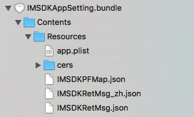

# 4.2.2 iOS 环境配置

iOS的所有配置，都需要在Unity中编译导出Xcode工程后，在Xcode工程进行配置

## 1.编译选项

  在Xcode工程 -> Build Settings -> Linking -> Other Linker Flags 中，添加如下编译选项：
  
  ```sh
  -all_load
  ```
  
  
  如果遇到Bitcode报错（Unity 4.x版本不支持），可以通过在Xcode工程 -> Build Settings -> Build Options -> Enable Bitcode 中，将值修改为No
    
## 2.基础代码调用

Unity编译导出Xcode工程后，需要在工程中添加必要的代码，iMSDK插件才能正常运行

* 添加头文件

  在Xcode工作中，找到UnityAppController.mm文件，添加头文件引用

  ```mm
  #import <IMSDKCoreKit/IMSDKCoreKit.h>
  ```

* 应用启动

在UnityAppController.mm文件AppDelegate中，找到如下方法

```
- (BOOL)application:(UIApplication *)application didFinishLaunchingWithOptions:(nullable NSDictionary *)launchOptions
```

添加如下代码调用

```
[[IMSDKApplicationDelegate sharedInstance] application:application
 						 didFinishLaunchingWithOptions:launchOptions
                    			        withGameSecret:@"YOUR_GAME_SECRET"];
```

> YOUR_GAME_SECRET 为游戏访问iMSDK服务器秘钥串，需要换成真实的秘钥串，可以跟iMSDK后台获取，请[联系我们](../../Pre/contact.md)确认该值
    
* 应用间跳转处理

**iOS9以及以上的编译环境中**
	
在UnityAppController.mm文件AppDelegate中，添加如下代码调用

```mm
- (BOOL)application:(UIApplication *)app openURL:(nonnull NSURL *)url options:(nonnull NSDictionary*)options {
    return [[IMSDKApplicationDelegate sharedInstance] application:app
                                                          openURL:url
                                                         options:options];}
```
	
**iOS9以下编译环境**
在UnityAppController.mm文件AppDelegate中，找到如下方法

```mm
    - (BOOL)application:(UIApplication *)application openURL:(NSURL *)url sourceApplication:(nullable NSString *)sourceApplication annotation:(id)annotation
```

添加如下代码调用

```mm
    - (BOOL)application:(UIApplication *)application openURL:(NSURL *)url sourceApplication:(NSString *)sourceApplication annotation:(id)annotation {
            return [[IMSDKApplicationDelegate sharedInstance] application:application
                                                                  openURL:url
                                                        sourceApplication:sourceApplication
                                                                annotation:annotation];
}
```
    
## 3.HTTPS证书文件
    
  将iMSDKServer.cer证书文件拖到Xcode工程中，并在Xcode工程 Build Phases -> Copy Bundle Resources中，确认iMSDKServer.cer文件已经添加到拷贝列表
    
  > 如果没有，可以点击下方“+”，在弹出的选择框中选中添加的证书文件，点击“Add”进行添加
   
  
  
  如需要获取证书证书，请点击[HTTPS证书说明](../../Help/httpscertfile.md)查看具体方法
  
  
## 4.iOS配置项详解

###概述
iMSDK（iOS）配置文件保存于**IMSDKAppSetting.bundle->Contents->Resources**中，如下图

  

+ app.plist ， 包括iMSDK服务配置（域名、游戏ID、调试级别等）以及各大第三方渠道配置。
+ IMSDKPFMap.json，支付渠道和PF字段对应关系，默认情况下业务侧无需关心。
+ IMSDKRetMsg.json（IMSDKRetMsg_xxx.json）, IMSDK错误码的描述信息，默认情况下业务侧无需关心。
+ cers文件夹，IMSDK HTTPS请求兼容的本地证书，默认情况下业务侧无需关心。

###app.plist配置项详解

+ **GameId**，游戏ID，由IMSDK后台分配生成，不同业务对应不同的ID；
+ **IMSDKLogLevel**，IMSDK调试级别配置；1-调试级别。程序输出debug信息时用，2-普通级别。记录一般性的非错信息，3-警告信息.，4-警告信息.，5-严重错误。只在系统层发生严重错误时，才用此级别；
+ **IMSDKServerNotice** ，IMSDK公告模块域名配置，支持 scheme://host 和 host 两种方式
，可通过配置下发更新；
+ **IMSDKServerHelp**，，IMSDK帮忙模块域名配置，支持 scheme://host 和 host 两种方式
，可通过配置下发更新；
+ **IMSDKServerConfig**，IMSDK配置模块域名配置，支持 scheme://host 和 host 两种方式
，可通过配置下发更新；
+ **IMSDKServer** ， IMSDK除公告、帮忙、配置三大模块之外，其他功能模块域名配置，包括登录鉴权、好友列表等，仅支持host方式，可通过配置下发更新；
+ **KeychainEnable**，是否开启keyChain功能保存游客ID，默认开启；
+ **KeychainSync**，是否开启keyChain同步功能，默认关闭；
+ **IMSDKNoticeIntervalRequest**，公告拉取间隔，优先级：后台配置>此配置项>5分钟
+ **WebViewOrientation**,IMSDK webview旋转支持。0默认，1竖屏，2横屏，3是全支持。
+ **QuickLoginCheck**，快速登录(quicklogin)是否检测第三方渠道token有效性

> **WebViewOrientation**配置，需要在UnityAppController.mm文件中，重载以下函数
```
- (NSUInteger)application:(UIApplication *)application supportedInterfaceOrientationsForWindow:(UIWindow *)window
{
    return [[IMSDKApplicationDelegate sharedInstance] application:application supportedInterfaceOrientationsForWindow:window];
}
```

### 下一步
 
 1. [完成渠道配置](../Channel/README.md)
 2. [快速集成](../quickstart.md)

